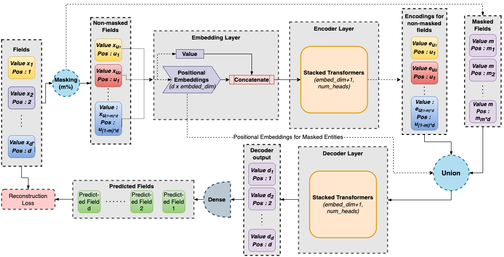

# MET : Masked Encoding Tabular Data

This repository is the official implementation of [MET](). 


## Requirements

To install requirements use python version >=3.7:

```setup
pip install -r requirements.txt
```

## Standard Training (MET-S)

To train the model(s) in the paper for FashionMNIST, run this command:

```train
python3 train.py
```

The following hyper-parameters are available for train.py :
+ **embed_dim** : Embedding dimension
+ **ff_dim** : Feed-Forward dimension
+ **num_heads** : Number of heads
+ **model_depth_enc** : Depth of Encoder/ Number of transformers in Encoder stack
+ **model_depth_dec** : Depth of Decoder/ Number of transformers in Decoder stack
+ **mask_pct** : Masking Percentage
+ **lr** : Learning rate

Each of the above can be changed by adding --flag_name=flag_value to train.py

## Adversarial Training (MET)

To train the model(s) in the paper for FashionMNIST trained using Adversarial training, run this command:
```train
python3 train_adv.py
```

The following hyper-parameters are available for train.py :
+ **embed_dim** : Embedding dimension
+ **ff_dim** : Feed-Forward dimension
+ **num_heads** : Number of heads
+ **model_depth_enc** : Depth of Encoder/ Number of transformers in Encoder stack
+ **model_depth_dec** : Depth of Decoder/ Number of transformers in Decoder stack
+ **mask_pct** : Masking Percentage
+ **lr** : Learning rate
+ **radius** : Radius of L2 ball model is being projected on
+ **adv_steps** : Adversarial loop length
+ **lr_adv** : Adversarial Learning Rate

## Adding new dataset :

You can try using the model on any new dataset by creating a csv file. The first column of the csv file should be class followed by the attributes. Sample csv files are available in [data](./data/)

To pass on the csv file to any of the training and evaluation scripts use the following flags :
+ **num_classes** : Number of classes
+ **model_kw** : Keyword for model (Eg fmnist for fashion-mnist)
+ **train_len** : Length of train csv
+ **train_data_path** : Path to train csv file
+ **test_len** : Length of test csv
+ **test_data_path** : Path to test csv files

- By default models are stored in [saved_models](./saved_models/)]. You can change the training path using flag **model_path**.
- Synthetic dataset can be created using [get_3d_dataset.py](./data/get_3d_dataset.py). By default a created dataset is available in [data](./data/3d_train.csv)

## Pre-trained Models

Pretrained models for FashionMNIST for optimal adversarial training setting is available in [saved_models](./saved_models/). You can extract the models using command:
```7z
7z e fmnist_saved.7z.001
```
```
7z e fmnist_saved_adv.7z.001
```

## Evaluation

To evaluate my model on Saved Models on the saved models, run:

```eval
python3 eval.py --model_path="./saved_models/fmnist_64_1_64_6_1_70_1e-05" --model_path_linear="./saved_models/fmnist_linear_64_1_64_6_1_70_1e-05" #For non-adversarial model
```

```
python3 eval.py --model_path="./saved_models/fmnist_adv_64_1_64_6_1_70_1e-05" --model_path_linear="./saved_models/fmnist_linear_adv_64_1_64_6_1_70_1e-05" #For adversarial model
```

By default results are written to **met.csv**.

## Results

Our model achieves the following performance on :
